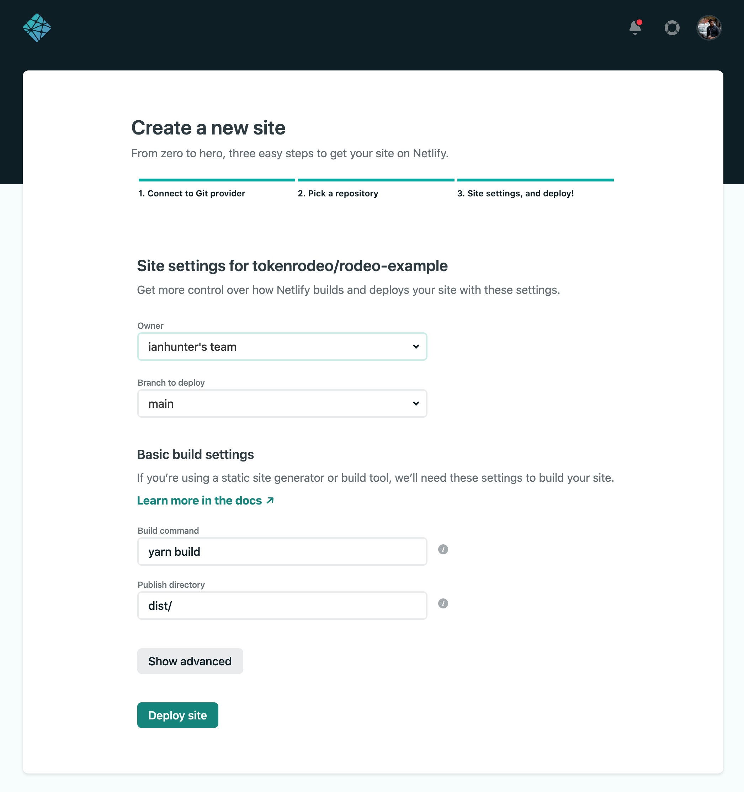

# Hosting Guide

### Netlify

Rodeo supports Netlify right out of the box. Simply pair your git repo using Netlify and it will know how to deploy it.



### IPFS

```text
yarn ipfs
```

This will deploy your site to IPFS using Pinata

